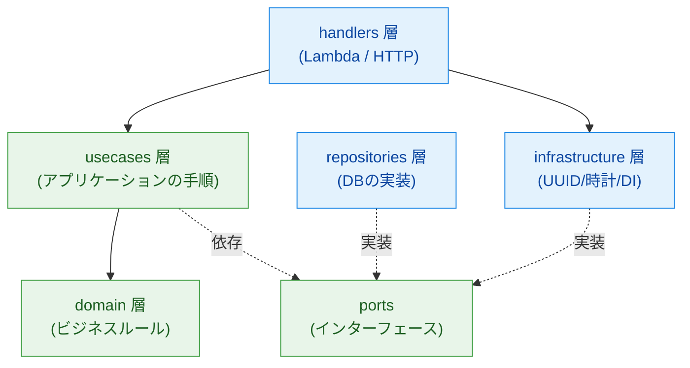
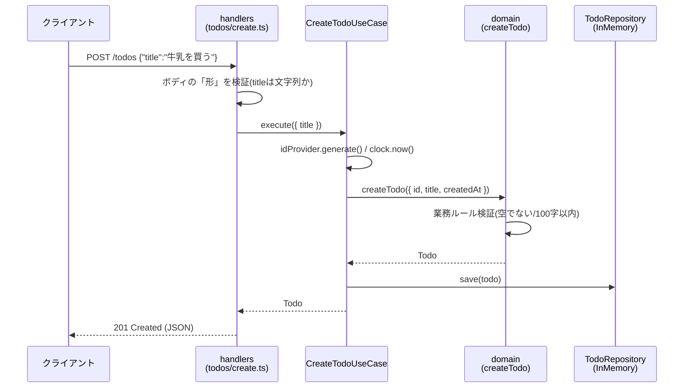

# アーキテクチャ解説（クリーンアーキテクチャ入門）

このドキュメントは、本テンプレートが採用している **クリーンアーキテクチャ / DDD** の考え方を、
同梱の **Todo API** を題材に日本語で解説する学習教材です。

「なぜ Lambda ハンドラーにビジネスロジックを直接書かないのか？」を、実際に動くコードで理解することを目的としています。

---

## 1. 全体像：4 つの関心を分ける

サーバーレス API は、放っておくと 1 つのハンドラー関数に「HTTP の処理」「業務ルール」「DB アクセス」が
すべて混ざりがちです。本テンプレートはこれらを層として分離します。



**依存の向きは常に「外側 → 内側（domain）」**です。
domain 層はどの層にも依存しません。これがクリーンアーキテクチャの最重要ルール（依存性のルール）です。

---

## 2. 各層の責務とファイル対応

| 層                 | 責務                                                                | 技術依存 | 本リポジトリのファイル                                |
| ------------------ | ------------------------------------------------------------------- | :------: | ----------------------------------------------------- |
| **domain**         | ビジネスルール・エンティティ。「Todo とは何か」「title は必須」など | ❌ なし  | `src/domain/entities/todo.ts`, `src/domain/errors.ts` |
| **usecases**       | アプリの操作手順。「Todo を作成する」の流れを組み立てる             | ❌ なし  | `src/usecases/*.ts`                                   |
| **ports**          | usecases が外部に求める抽象（インターフェース）                     | ❌ なし  | `src/usecases/ports/*.ts`                             |
| **repositories**   | ports（永続化）の具体実装                                           | ✅ あり  | `src/repositories/in-memory-todo-repository.ts`       |
| **infrastructure** | ports（UUID・時計）の実装と依存の結線（DI）                         | ✅ あり  | `src/infrastructure/*.ts`                             |
| **handlers**       | Lambda/HTTP の入口。入出力の変換とエラー→ステータス変換             | ✅ あり  | `src/handlers/**/*.ts`                                |

ポイントは、**技術に依存しない中心（domain / usecases / ports）** と、
**技術に依存する外周（handlers / repositories / infrastructure）** を分けていることです。

---

## 3. リクエストはどう流れるか（POST /todos）



注目すべきは **検証が 2 段階**に分かれている点です。

- **handlers 層**：入力の「形」を検証（`title` が文字列として存在するか）→ 満たさなければ `400`
- **domain 層**：業務ルールを検証（空文字でない、100 文字以内）→ 満たさなければ `ValidationError`

「HTTP のことは handler が」「業務ルールは domain が」責任を持つ、という分担です。

---

## 4. なぜ層を分けるのか（3 つの利点）

### (1) テストが速く・安定する

domain と usecases は技術に依存しないため、AWS もDBも起動せずに単体テストできます。
`id` や現在時刻すら `IdProvider` / `Clock` ポート経由で注入するので、`new Date()` をモックする必要がなく、
**決定的（毎回同じ結果）** なテストになります。

```ts
// __tests__/usecases/todo-usecases.test.ts より
const fakeIdProvider = (value: string): IdProvider => ({
  generate: () => value,
})
const fakeClock = (value: string): Clock => ({
  now: () => value,
})

const useCase = new CreateTodoUseCase(
  repo,
  fakeIdProvider('id-1'),
  fakeClock('2026-01-01T00:00:00.000Z')
)
```

### (2) 技術を差し替えられる

`TodoRepository` は「インターフェース（port）」です。今はインメモリ実装ですが、
本番で DynamoDB に変えたくなったら、**`infrastructure/todo-container.ts` の 1 行を差し替えるだけ**で済みます。
domain / usecases 層のコードは一切変わりません。

```ts
// 今: const todoRepository = new InMemoryTodoRepository()
// 本番: const todoRepository = new DynamoDbTodoRepository(client)
```

### (3) ビジネスロジックが技術の都合から守られる

「title は必須」というルールは domain 層にあります。HTTP フレームワークや DB を変えても、
このルールは影響を受けません。ビジネスの本質が、技術的な変更から隔離されます。

---

## 5. インメモリ実装と Lambda の状態について（重要）

`InMemoryTodoRepository` はデータを**プロセス内のメモリ（Map）**に保持します。ここには学びがあります。

- **ローカル（`yarn dev` / serverless-offline）**：全ルートが 1 プロセスで動くため状態が共有され、そのまま動きます。
- **実際の AWS Lambda**：関数インスタンスごとにプロセスが分かれ、スケールすると状態は共有されません。

本テンプレートでは Todo の 4 ルートを **単一の Lambda 関数（lambdalith）** で受け、
内部ルーター（`src/handlers/todos/index.ts`）で振り分けています。こうすることで 1 インスタンス内では
インメモリの状態が共有され、デモが素直に動きます。

ただし複数インスタンスにスケールしたり、再起動をまたいでデータを保持したい場合は、
インメモリでは不十分です。**その差し替えポイントこそが `TodoRepository` ポート**です
（→ 本番では DynamoDB 実装に置き換える）。「なぜインターフェースを挟むのか」の答えがここにあります。

---

## 6. 新しいエンドポイントを追加する手順

Todo の実装をなぞれば、新しいリソース（例：User）も同じ型で追加できます。TDD で進めます。

1. **テストを書く**（`__tests__/`）：期待する入出力を先に書き、失敗を確認する
2. **domain**：エンティティと業務ルール（`src/domain/entities/user.ts`）
3. **ports**：必要なら新しいリポジトリ interface（`src/usecases/ports/user-repository.ts`）
4. **usecases**：操作の手順（`src/usecases/create-user.ts`）
5. **repositories / infrastructure**：port の実装と結線
6. **handlers**：入口を作り、`http.ts` でエラー→ステータス変換
7. **serverless.yml**：関数とルートを追加
8. `yarn test` と `yarn lint` が通ることを確認する

---

## 7. テスト駆動開発（TDD）の流れ

本テンプレートは TDD を前提にしています（`CLAUDE.md` 参照）。

1. 期待する入出力に基づき、**まずテストを書く**
2. 実行して **失敗（Red）** を確認する
3. テストを通す **最小限の実装（Green）** を書く
4. 重複を除き **リファクタ** する
5. `yarn lint` まで通す

Todo の各層はこの流れで実装されています。テストファイル（`__tests__/`）を先に読むと、
各層が「何を約束しているか」が分かりやすいはずです。

---

## 8. さらに学ぶなら

- 本番の永続化：`TodoRepository` を DynamoDB 実装に差し替える（AWS SDK v3 + DynamoDB Local）
- 入力バリデーション：`zod` などでハンドラー層のスキーマ検証を強化する
- 認証：API Gateway のオーソライザや Cognito を足す
- CI：GitHub Actions で `yarn test` / `yarn lint` を自動化する

これらはいずれも **外周（handlers / infrastructure / repositories）** の変更で完結し、
domain / usecases の中心は安定したまま拡張できます。それがクリーンアーキテクチャの狙いです。
